# Detection of brain tumors in MRI brain images

Alfonso Imanol Macias Marañon - A01808099

## Project description

The main objective of this project is to use machine learning to accurately classify MRI images into two categories: healthy tissue and images containing tumors.

## Dataset description

The dataset used in this project was obtained from the [Brain MRI Images for Brain Tumor Detection](https://www.kaggle.com/datasets/navoneel/brain-mri-images-for-brain-tumor-detection) platform and consists of a collection of brain magnetic resonance imaging (MRI) scans designed for brain tumor detection. 

The dataset is divided into two main categories: images labeled **“yes”**, which contain abnormalities or spheroids associated with brain diseases and potential tumors, and images labeled **“no”**, which do not exhibit such abnormalities.

The complete dataset contains a total of 253 images, distributed as 155 images in the **“yes”** class and 98 images in the **“no”** class. 

## Data preprocessing

### Data transformation

The first step was to preprocess the MRI images in order to improve model performance and facilitate the training process. The following transformations were applied:
- Standardizing file names to facilitate visualization and iteration during data processing.
- Removal of the black borders surrounding the MRI scans.
- Normalization of all images to a fixed size of **256 × 256 pixels**.
- Conversion of image files to the **PNG** format to ensure consistent image quality.

These preprocessing steps were performed using the `cleandataset.py` script. The script processed the original Kaggle dataset by converting the images into pixel arrays, transforming them into grayscale representations, generating binary masks to identify the relevant brain region, and then cropping and resizing the images.

### Data splitting
```text
data/
└── dataset__readytouse/
    ├── train/
    │   ├── yes/
    │   └── no/
    ├── validation/
    │   ├── yes/
    │   └── no/
    └── test/
        ├── yes/
        └── no/
```
The dataset was manually split into three subsets: **training**, **testing**, and **validation**. The resulting directory structure was stored in the `dataset_readytouse` folder.

**Class: YES** (*N = 155*)

* Training: 93 images (60%)
* Testing: 31 images (20%)
* Validation: 31 images (20%)

**Class: NO** (*N = 98*)

* Training: 60 images (61.2%)
* Testing: 19 images (19.4%)
* Validation: 19 images (19.4%)

**Overall dataset:** 253 images.

The dataset was partitioned using an approximately balanced **60/20/20 split** across both classes, ensuring a similar class distribution in the training, testing, and validation subsets.

### Data augmentation

Due to the limited size of the dataset, data augmentation techniques were applied during training to increase data variability and improve the model's generalization ability. The following transformations were used:

* **Rotation:** Images were randomly rotated within a small range (±5% of a full rotation) using nearest-neighbor interpolation to preserve image continuity.
* **Translation:** Images were randomly shifted both horizontally and vertically by up to 5% of their dimensions.
* **Zoom:** Random zoom-in and zoom-out transformations of up to 10% were applied to simulate variations in image scale.
* **Contrast adjustment:** Image contrast was randomly modified by up to 10%, helping the model become more robust to intensity variations commonly found in MRI scans.

These augmentations were applied dynamically during training, generating slightly different versions of the images at each epoch and reducing the risk of overfitting.

## Model training
### Hyperparameters (Model Configuration)

The initial model configuration is the one below. This came from multiple references to adecuate and increase the model performance during training. Model configurations changed during iterations and after switching into another model, but the main configuration idea was compared through all investigation.

| Parameter | Value / Configuration | Rationale / Reference |
| --- | --- | --- |
| **Input Dimensions** | 256 | 256 x 256 pixels square resolution for spatial consistency. |
| **Batch Size** | 8 | Set in accordance with Angelina et al. (2026, p. 9) for memory constraints. |
| **Epochs** | 100 | Sufficient horizon to ensure convergence. |
| **Learning Rate** | 0.0001 (Static) | Set in accordance with He et al. (2015, p. 4). |
| **Dropout Rate** | 0.5 | Applied for regularization to mitigate overfitting (Hinton et al., 2012, p. 2). |
| **Activation Function** | Sigmoid | Employed in the final layer for single-class probability mapping. |
| **Loss Function** | Binary Cross-Entropy | Selected to complement the single-neuron sigmoid output. |
| **Optimizer** | Adam | Back propagation optimization. |
| **Data Augmentation** | Rotation, translation, zoom, and contrast | Applied only to training batches to reduce overfitting in the small dataset. |
| **Threshold** | 0.5 | The number required to identify and separate classes between each other. Since the main class is "yes" (tumor found), predicting a number over 0.5 means the neuronal network labeled it as tumor found.


## 1. Model cnn_propia_01

The baseline model was inspired from the VGG19 architecture defined by He, K., Zhang, et al. (2015). The first model was a sequential model with the following architecture having 3 Blocks.

### Training Configuration

- Image size: 256 × 256  
- Batch size: 8  
- Epochs: 100  
- Learning rate: 0.0001  
- Dropout: 0.5  
- Loss function: binary crossentropy  
- Output activation: sigmoid  
- Label mode: binary  
- Early stopping patience: 10  
- Classification threshold: 0.5  
- Random seed: 42  

Each block contained:
- 2 Conv2D layer with 16 filters, kernel size of (3, 3), and ReLU activation function.
- Followed by a MaxPooling2D layer of (2, 2).

Lastly, the head contained:
- Flatten layer
- Dense layer with 32 units and ReLU activation function
- Dropout 0.5
- Dense 1, sigmoid activation

Thre results showed 536,401 params (2.05 MB), which, after investigation, seemed like quite a lot for this dataset (253 images).

|Accuracy|Precision|Recall|F1 Score|Specificity|ROC-AUC|
|---|---|---|--|---|--|
|0.6274509803921569|0.62|1.0|0.7654320987654321|0.05|0.732258064516129|

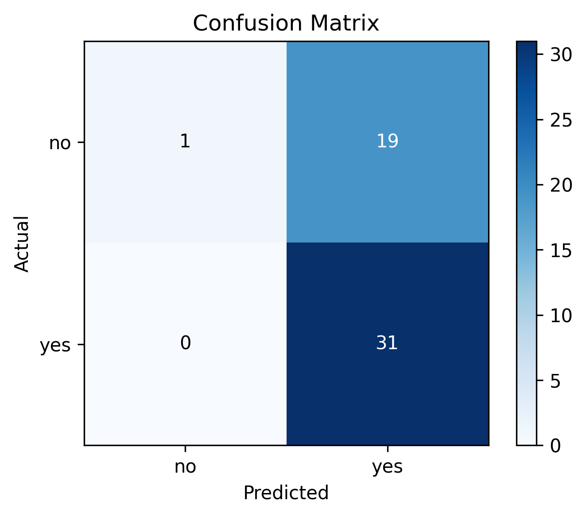

The initial results appeared very promising for a first iteration of the model. With an F1 score of 0.76 and an AUC of 0.73, the model seemed to perform well overall.

However, a closer inspection of the confusion matrix revealed a major limitation. Although the model achieved high recall, it was almost completely unable to identify healthy images (tumor not found). This indicates that the model was heavily biased toward predicting the presence of a tumor, making the overall performance metrics misleading.

The learning rate and training process appeared to be stable. Loss curves were used to evaluate whether the model was overfitting or underfitting. As shown in the training history, both the training and validation losses followed a similar downward trend, suggesting that the model was learning consistently and was not exhibiting clear signs of overfitting.

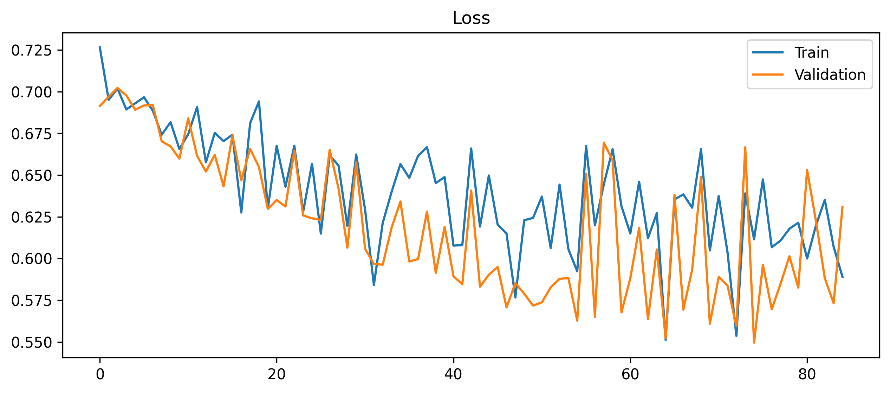
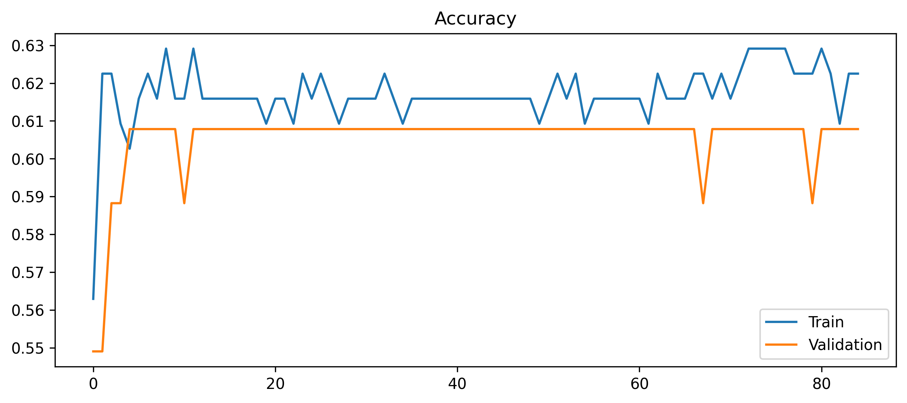

Based on these observations, the next experiment focused on reducing the learning rate from 0.001 to 0.0001. A lower learning rate should allow the model to learn more discriminative features from the images and potentially improve classification performance. The model will be trained from scratch to ensure a fair evaluation of the new configuration.


## 2. Model cnn_propia_02

Each block consisted of two Conv2D layers with 16 filters, a kernel size of (3, 3), and ReLU activation functions, followed by a MaxPooling2D layer with a pool size of (2, 2). The classification head included a Flatten layer, a Dense layer with 32 units and ReLU activation, a Dropout layer with a rate of 0.5, and a final Dense layer with a single unit and a sigmoid activation function for binary classification.

### Training Configuration

- Image size: 256 × 256  
- Batch size: 8  
- Epochs: 100  
- Learning rate: 0.001  
- Dropout: 0.5  
- Loss function: binary crossentropy  
- Output activation: sigmoid  
- Label mode: binary  
- Early stopping patience: 10
- Classification threshold: 0.5  
- Random seed: 42  

Now, with the new learning rate of 0.001 these are the results:

|Accuracy|Precision|Recall|F1 Score|Specificity|ROC-AUC|
|--|--|--|--|--|--|
|0.5490196078431373|0.6052631578947368|0.7419354838709677|0.6666666666666666|0.25|0.5129032258064516|

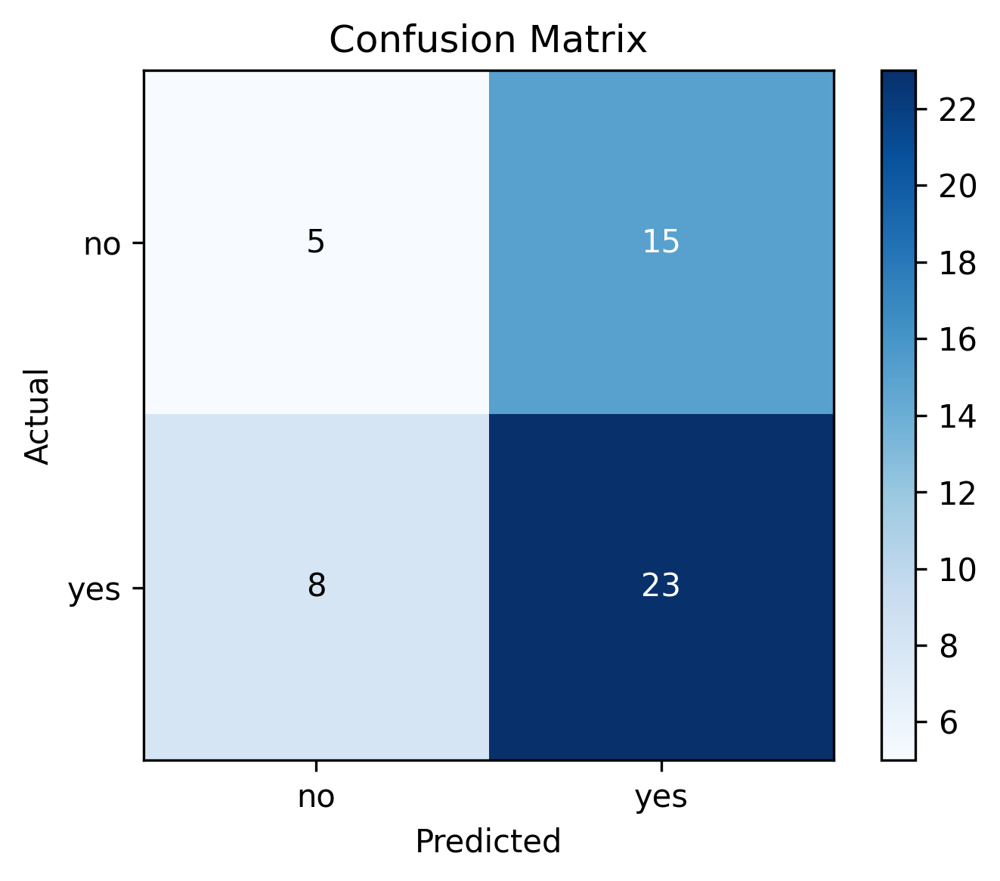

Although the F1 score and recall decreased compared to the previous model, the specificity improved, which is also reflected in the confusion matrix. While the overall performance is still not satisfactory, the increase in specificity represents a meaningful improvement, as the model is beginning to better distinguish between healthy and affected images. 

Despite increasing the learning rate, the model still failed to correctly identify negative cases. This suggests that the issue may not be related to the optimization process alone, but rather to the model architecture itself. One possible explanation is that the network has insufficient capacity to learn the features required to distinguish between healthy and affected images. 

Additionally, the loss decreased sharply from 2.5 to 0.6 during the first epoch, which compressed the scale of the loss plot and made it difficult to visually analyze the remaining training progress. Another observation was that training consistently stopped after 10 epochs, matching the EarlyStopping patience value. This raises the possibility that the model is being stopped before it has enough time to fully converge.

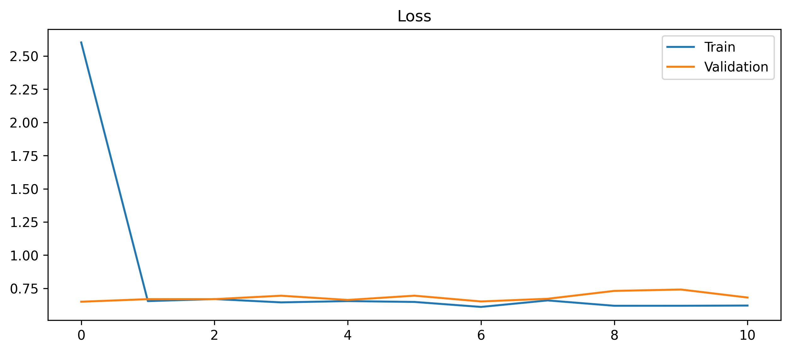
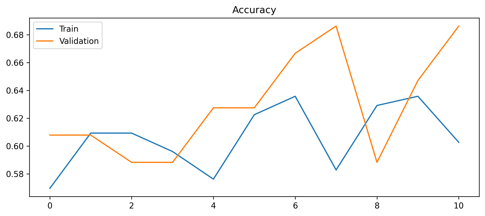


These are the changes for the next model iteration:
- Learning rate: 0.01 <- 0.001
- EarlyStopping patience: 15 epochs <- 10 epochs
- Switch checkpoint saving criteria: Save best based on F1 Score granted from validation <- Accuracy from validation
- Total trainable params: 8,417,377 params <- ~500k params

Finally, the architecture was redesigned to significantly increase the number of trainable parameters, increasing from approximately 500,000 to around 8.4 million parameters in an effort to improve generalization.

Architecture changes:
- Removed one block from the network (Conv2D + Conv2D + MaxPooling2D)
- Increased the number of neurons for each convolutional layer: 32 <- 16


## 3. Model cnn_propia_03

The performance decrease again notibly. The Recall came back to 1.0 and F1 score increased to 0.75. Comparing these results to the confussion matrix, the model is again predicting everything as tumor found.

### Training Configuration

- Image size: 256 × 256  
- Batch size: 8  
- Epochs: 100  
- Learning rate: 0.01  
- Dropout: 0.5  
- Loss function: binary crossentropy  
- Output activation: sigmoid  
- Label mode: binary  
- Early stopping patience: 15
- Classification threshold: 0.5  
- Random seed: 42  

The model continues to predict almost all samples as positive, which is reflected in the evaluation metrics. Although accuracy is 0.6159 and AUC is 0.5825, the F1 score remains relatively high at 0.7623 due to the imbalance in predictions. Recall is consistently 1.0000 on both training and validation sets, indicating that the model is classifying all cases as positive and failing to correctly identify negative samples. In this context, recall is not a reliable indicator of performance, and specificity becomes the more relevant metric for evaluating model behavior.

Given the small size of the dataset, the next step is to move toward transfer learning in order to leverage pre-trained feature extractors. During analysis, it was also observed that the use of a Flatten layer may be negatively impacting performance. Flatten converts the entire feature map into a very large vector, effectively preserving all spatial activations in a high-dimensional representation. In contrast, GlobalAveragePooling2D reduces each feature map to a single value by averaging activations, resulting in a more compact representation. This approach summarizes how strongly each detector is activated and may improve generalization, especially in small datasets.

|Accuracy|Precision|Recall|F1 Score|Specificity|ROC-AUC
|--|--|--|--|--|--|
|0.6078431372549019|0.6078431372549019|1.0|0.7560975609756098|0.0|0.5072580645161291|


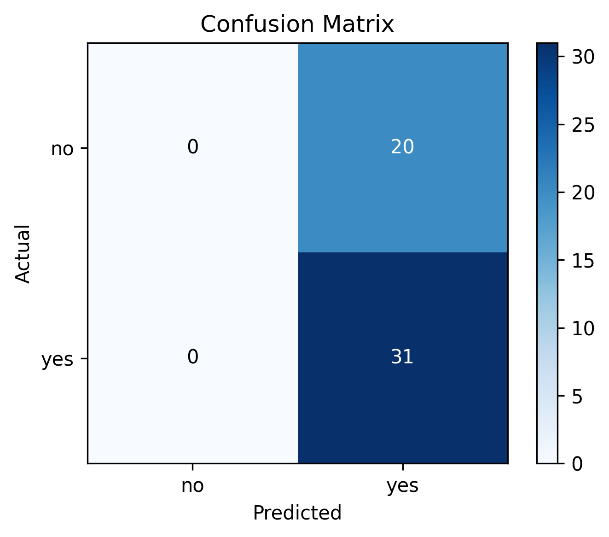

The loss graph has been created starting from the 1st earliest epoch so it can be visually analized. The loss graph seemed to stay consistently for epoch, all the values where between 0.68 and 0.64, matching the EarlyStopping patience value this indicates that the model did not improve after the first epoch. This model apported more knowledge and around how convolutional neuronal networks improve, but the overall model does not indicate improvement. 

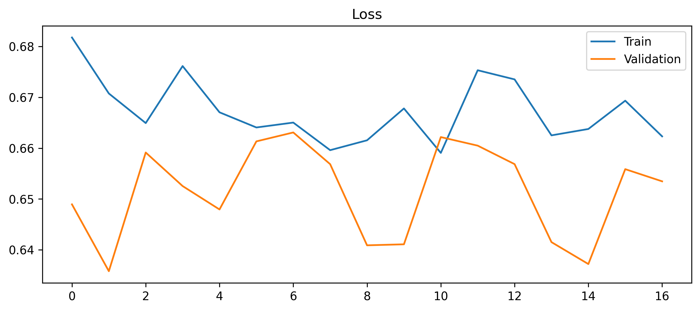
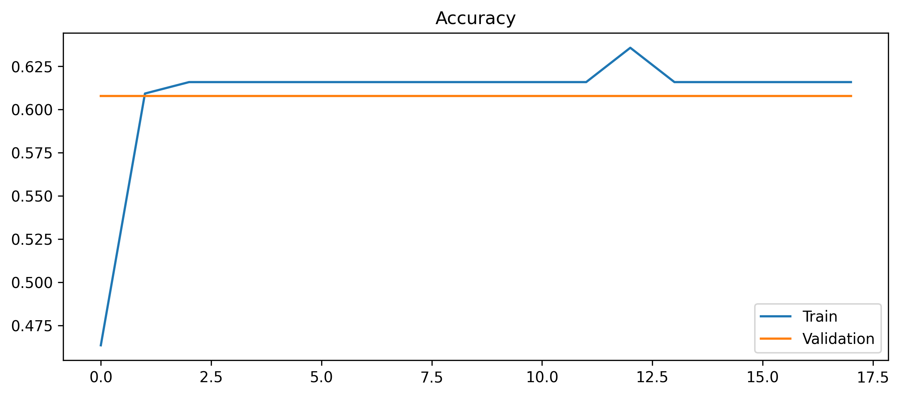


These are the changes for the next model iteration:
- Learning rate: 0.0001 <- 0.01
- Flatten layer was replaced with GlobalAveragePooling2D, and the Dense layer with 32 units was removed. 
- Dense layer was removed because it significantly increases the number of trainable parameters. 

This change was motivated by the hypothesis that Flatten may not be the most appropriate choice for this architecture, as it expands the feature maps into a very large vector and can lead to inefficient representations of spatial information. In contrast, GlobalAveragePooling2D reduces each feature map to a single value, which can help preserve the most relevant activations while improving generalization.

Although the initial goal was to maintain a model with around 500k parameters, this revised architecture further reduces complexity and helps mitigate overfitting risks. The learning rate was also reset to 0.0001 to ensure stable training after these structural changes. As a result, the total number of parameters was reduced dramatically from approximately 8.4 million to 28,673.

Architecture changes:
- GlobalAveragePooling2D layer <- Flatten layer 
- Non-Output Dense layer removed


## 4. Model cnn_propia_04

There is a noticeable improvement in specificity, although the model previously suffered from a strong bias toward predicting all samples as positive. In this iteration, it has begun correctly identifying negative cases, achieving approximately 25% correct classification of negatives in the test set. This indicates a partial recovery in class balance handling, even if performance is still limited.

The architectural changes, particularly replacing Flatten with GlobalAveragePooling2D and removing the Dense layer, appear to have had a significant positive impact. It is possible that most of the improvement comes from removing the Dense layer, since it previously introduced a large number of parameters and may have contributed to overfitting. Additionally, maintaining a lower learning rate of 0.0001 likely helped stabilize training and reduced the tendency to converge toward a trivial solution dominated by positive predictions. Although the F1 score decreased by approximately 10% compared to the previous model, this trade-off is acceptable given the improvement in specificity, which addresses the main weakness observed in earlier iterations.

### Training Configuration

- Image size: 256 × 256  
- Batch size: 8  
- Epochs: 100  
- Learning rate: 0.0001
- Dropout: 0.5  
- Loss function: binary crossentropy  
- Output activation: sigmoid  
- Label mode: binary  
- Early stopping patience: 15
- Classification threshold: 0.5  
- Random seed: 42  

|Accuracy|Precision|Recall|F1 Score|Specificity|ROC-AUC|
|--|--|--|--|--|--|
|0.5294117647058824|0.5945945945945946|0.7096774193548387|0.6470588235294118|0.25|0.5145161290322581|

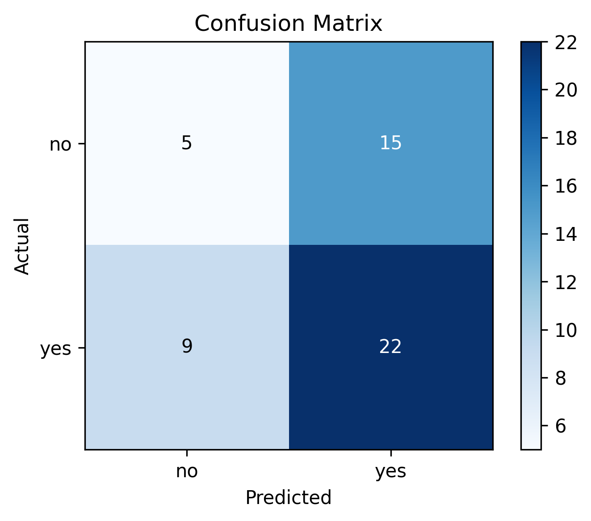
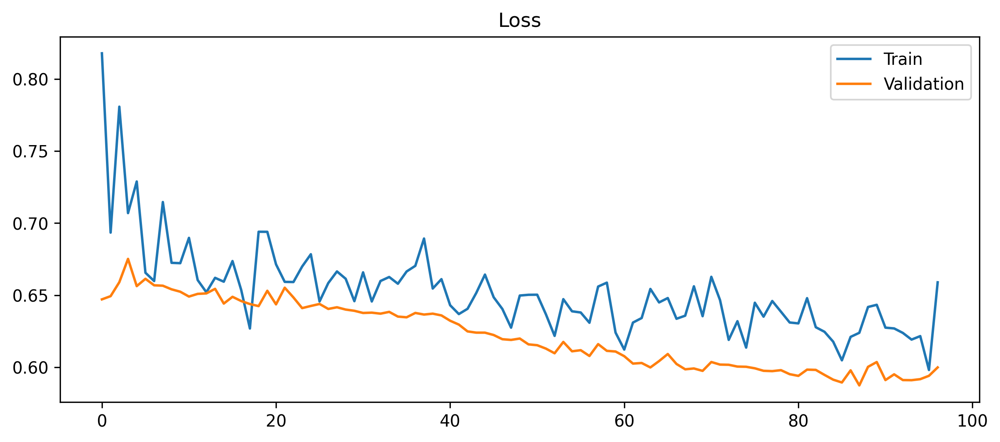
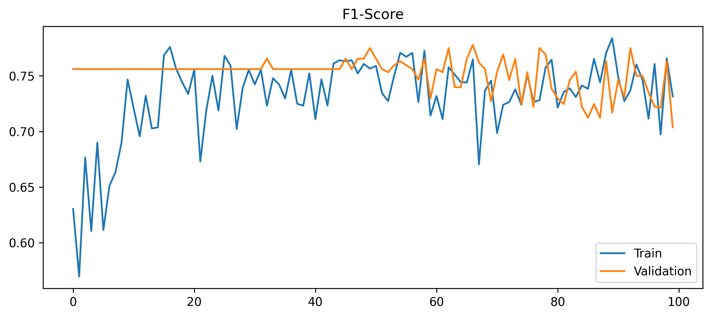
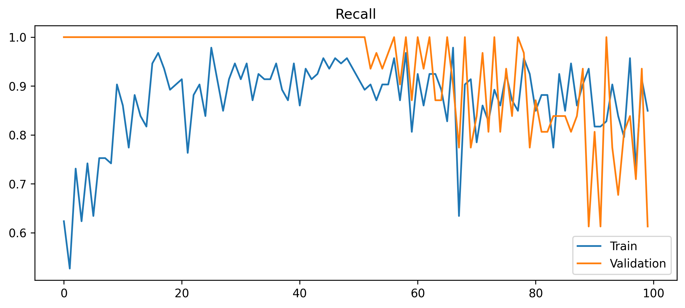
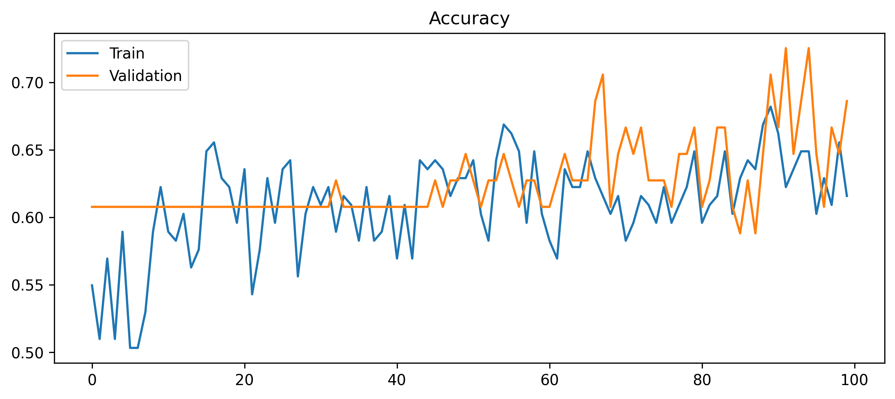


An intermediate experiment was conducted by adding a third identical convolutional block, increasing the total number of parameters to 74,913. However, this change reintroduced the previous issue where validation recall remained at 1.0 while the specificity still was lower than 0.1, indicating that the model was again biased toward predicting all samples as positive.

In practice, EarlyStopping controls the actual training duration, but the intent was to give the model additional opportunity to improve. During training, it was observed that after approximately epoch 55, recall began to decrease, and the model started predicting negative cases more frequently. This is a positive sign, as previous versions failed to identify negative samples at all. However, this behavior may also indicate potential overfitting, since performance degradation appears after extended training.

These are the changes for the next model iteration:
- Number of epochs was increased: 200 <- 100.
- EarlyStopping patience was reverted from 15 back to 10 to prevent excessive training. 
- The final model configuration in this iteration contains 47,169 parameters (184.25 KB).

Architecture changes:
- Added an additional convolutional layer to each block (Conv2D of 32 neurons).


## 5. Model cnn_propia_05

Now, the model struggles more with detecting positive cases, as reflected by the larger number of false negatives. The recall curve also shows considerable fluctuations during later epochs, suggesting that the model's sensitivity to positive samples is somewhat unstable. Despite these challenges, the F1-score remains relatively high, oscillating around 0.75–0.80, which indicates a balanced trade-off between precision and recall. The training and validation loss curves consistently decrease over the epochs, indicating that the network is effectively minimizing prediction errors without exhibiting severe overfitting. Similarly, both accuracy and F1-score demonstrate an upward trend, reaching approximately 69% training accuracy and around 77% validation accuracy by the end of training. Overall, the F1 Score of this last version of the model is by far the worst of all previous versions, the model learned to detect more negatives, but in the process it changed its bias towards labeling them mostly as heatlhy.

### Training Configuration

- Image size: 256 × 256  
- Batch size: 8  
- Epochs: 200  
- Learning rate: 0.0001
- Dropout: 0.5  
- Loss function: binary crossentropy  
- Output activation: sigmoid  
- Label mode: binary  
- Early stopping patience: 10
- Classification threshold: 0.5  
- Random seed: 42  

|Accuracy|Precision|Recall|F1 Score|Specificity|ROC-AUC|
|--|--|--|--|--|--|
|0.49019607843137253|0.6190476190476191|0.41935483870967744|0.5|0.6|0.4951612903225806|

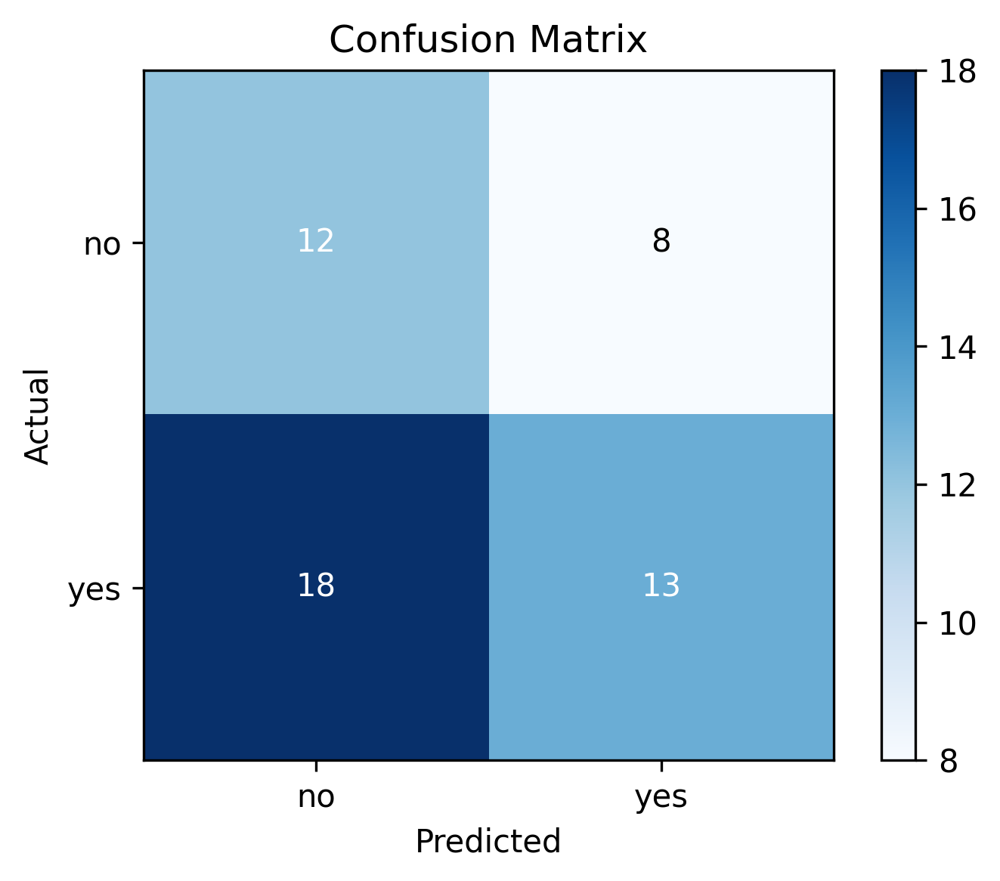
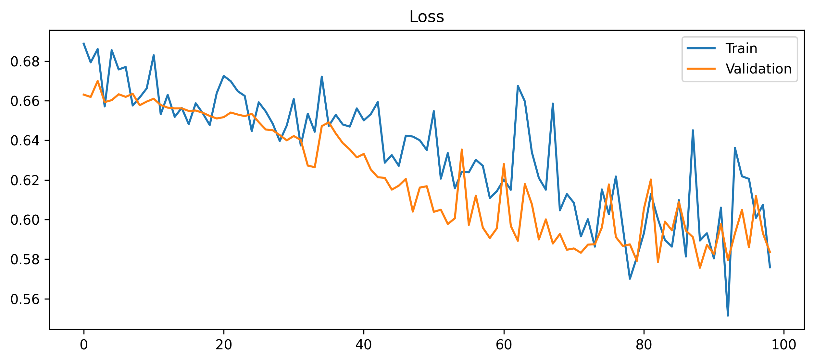
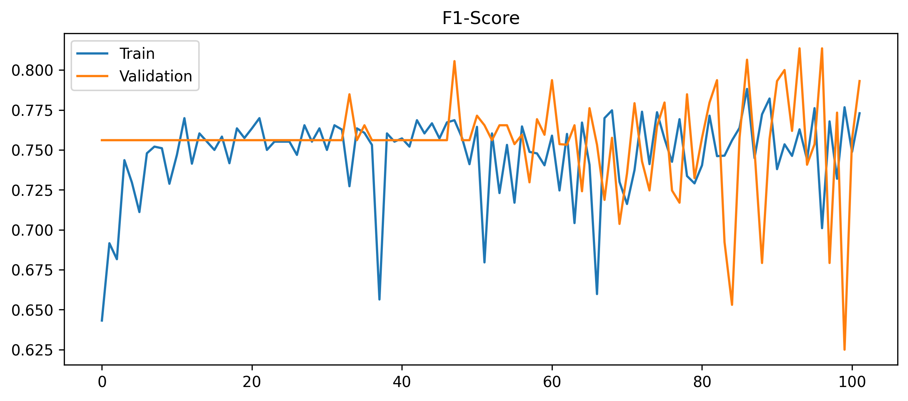
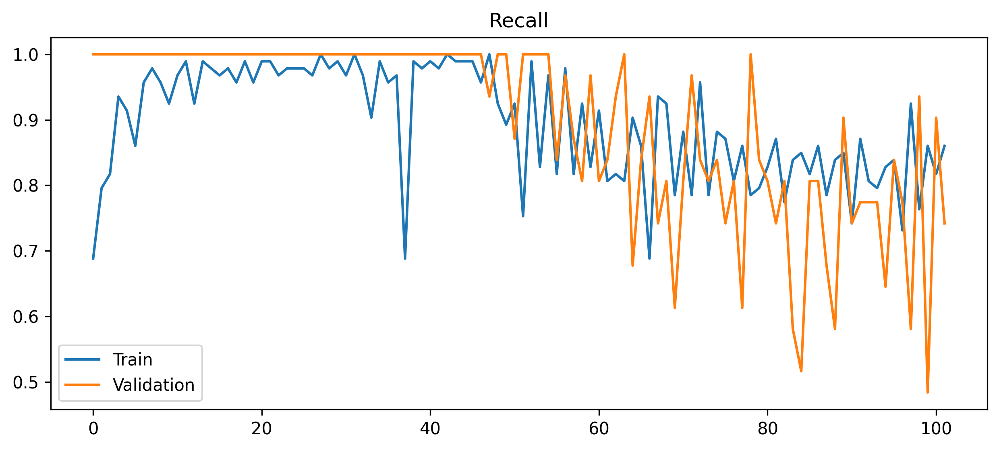
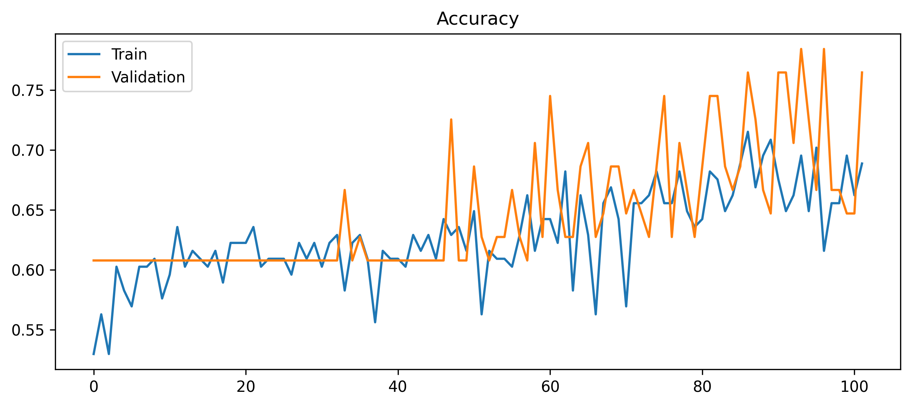


## 6. Model resnet50

Now with transfer learning, using resnet50, demonstrates excellent classification performance and a strong ability to generalize, as evidenced by the continuous improvement in training and validation metrics throughout the learning process. Accuracy and F1-score rapidly increase and stabilize above 95%, while the loss curves consistently decrease and remain low, indicating effective optimization and convergence. 

### Training Configuration

- Image size: 256 × 256  
- Batch size: 8  
- Epochs: 200  
- Learning rate: 0.0001
- Dropout: 0.5  
- Loss function: binary crossentropy  
- Output activation: sigmoid  
- Label mode: binary  
- Early stopping patience: 10
- Classification threshold: 0.5  
- Random seed: 42  

The close alignment between training and validation curves suggests that overfitting is minimal despite the high performance achieved. Furthermore, the confusion matrix shows that the model correctly classified 43 out of 51 samples, with only 3 false positives and 5 false negatives, resulting in a high level of reliability across both classes. The recall metric remains close to 100% for the validation set during most epochs, demonstrating the model’s capability to identify positive cases while maintaining the balanced.

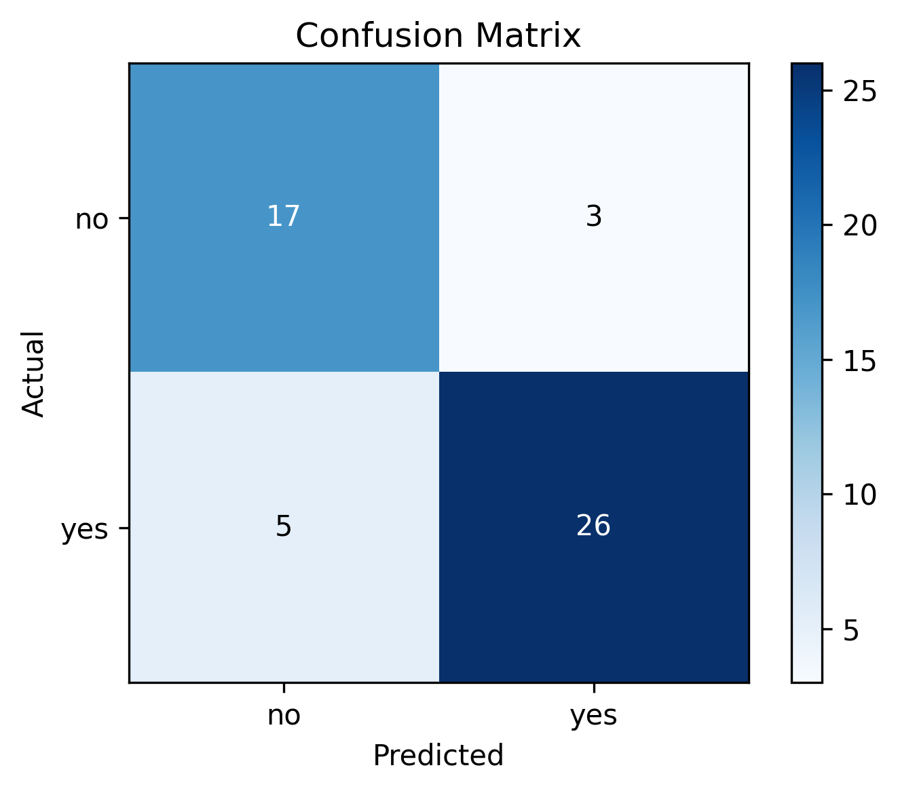
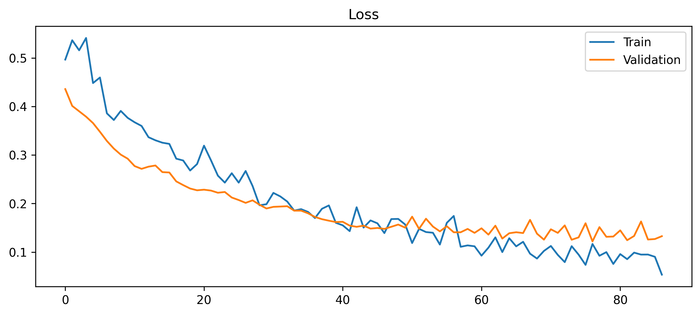
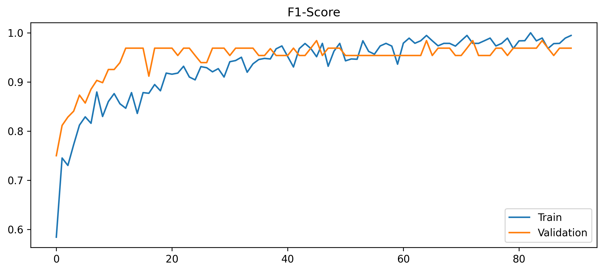
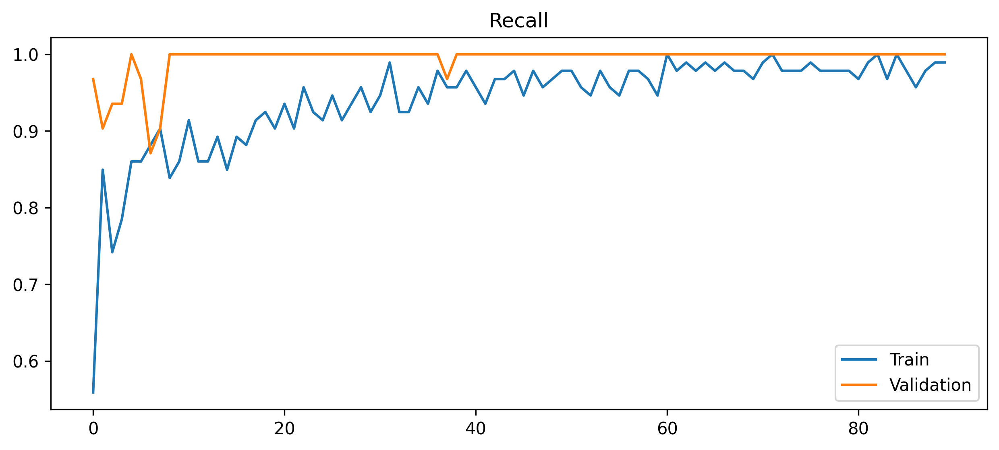
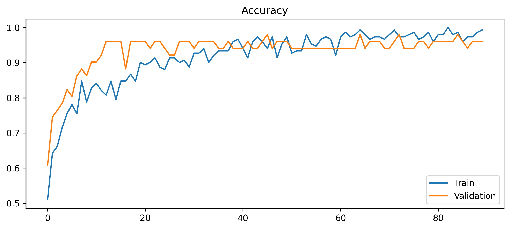


## 6. Model efficientnetb0

Now with transfer learning, using efficientnetb0, exhibits outstanding classification performance and strong generalization capabilities, as demonstrated by the increase in training and validation accuracy, F1-score, and recall throughout the training process.

### Training Configuration

- Image size: 256 × 256  
- Batch size: 8  
- Epochs: 200  
- Learning rate: 0.0001
- Dropout: 0.5  
- Loss function: binary crossentropy  
- Output activation: sigmoid  
- Label mode: binary  
- Early stopping patience: 10
- Classification threshold: 0.5  
- Random seed: 42  

Validation accuracy remains consistently high, stabilizing around 96–100%, while the loss curves show a continuous decrease, indicating effective learning and convergence without signs of significant overfitting. The close relationship between training and validation metrics suggests that the model is able to learn meaningful patterns and maintain robust performance on unseen data. 

This is further supported by the confusion matrix, where 46 out of 51 samples were correctly classified, with only 2 false positives and 3 false negatives. Recall values, approaching 100% for both training and validation sets, highlight the model’s strong ability to identify positive instances while maintaining excellent performance. 


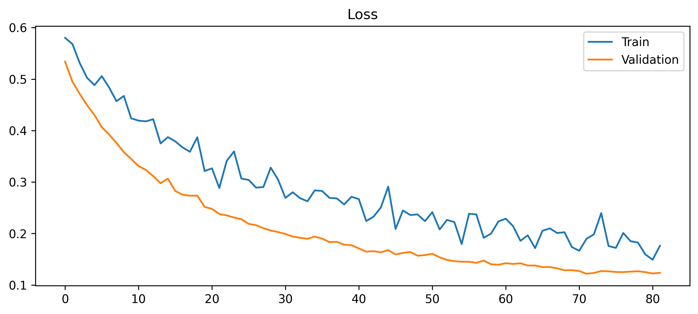
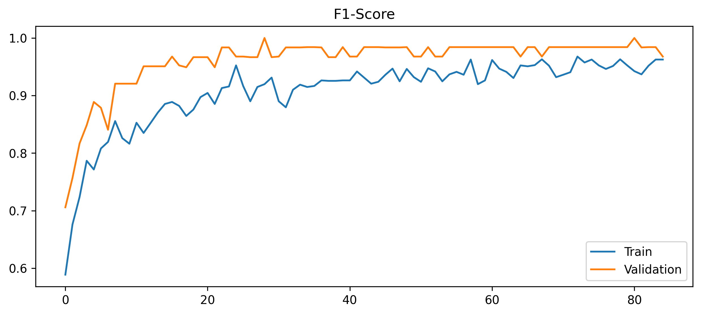
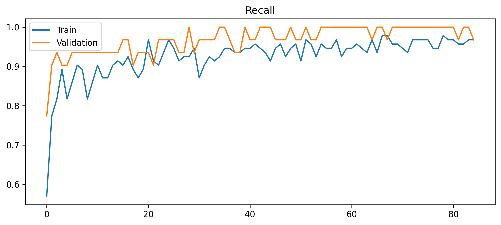
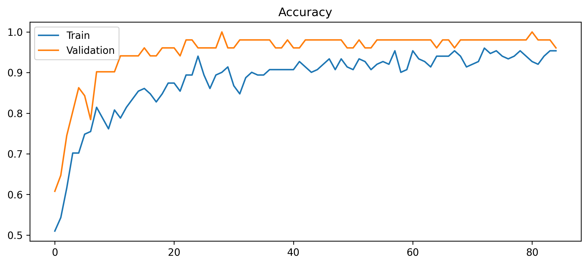


## Discussion 

The baseline model became increasingly usable throughout the training iterations. However, the final model was not sufficiently competitive because the achieved F1-score remained relatively modest after the Specificity was fixed. 

Although the dataset used for this project was suitable for experimentation and rapid prototyping due to its lightweight size (fewer than 200 images), it represents a limitation. Larger datasets are available on Kaggle, many containing over 2,000 images with greater variability in patient characteristics. Using a larger dataset would likely have improved the model's ability to generalize and reduced the risk of overfitting.

Another potential improvement would have been selecting the best model based on the ROC-AUC metric rather than solely relying on F1-score. ROC-AUC (Receiver Operating Characteristic – Area Under the Curve) is a widely used metric in machine learning and statistics that measures a model's ability to distinguish between positive and negative classes. And, since we were using a binary class (yes, no) for this task, it fits perfectly for the use case.

- The ROC curve itself is generated by plotting the True Positive Rate against the False Positive Rate at different classification thresholds. The Area Under the Curve (AUC) summarizes the entire curve into a single value ranging from 0.5 to 1.0. A value of 1.0 represents perfect class separation, while a value of 0.5 indicates no discriminative power, equivalent to random guessing. 

The efficientnetb0 model demonstrated a strong overall performance and proved to be a robust architecture for the brain tumor classification task. The obtained metrics indicate that the model is reliable and suitable for practical binary classification of MRI Tumor images.


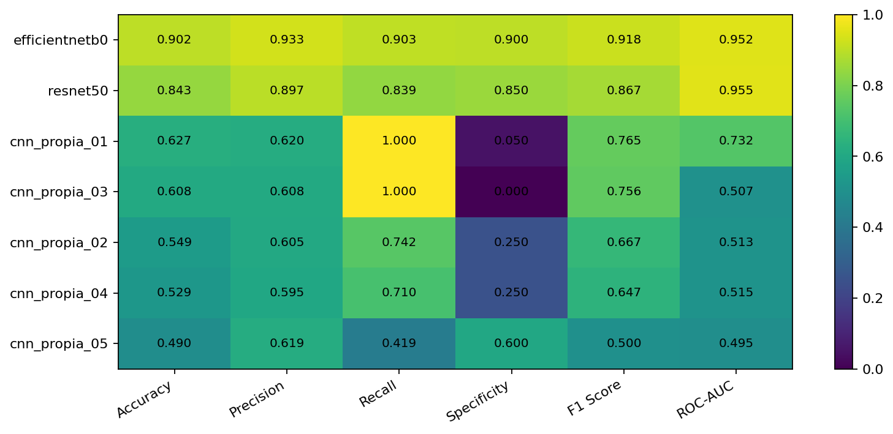

## References

- Maus, J., Nitschke, J., Nikulin, P., Hofheinz, F., Barth, M., Lemm, S., … Ullrich, M. (2026). Automatic Delineation of Tumor Spheroids in Microscopic Images Using Deep-Learning. ACS Measurement Science Au, 6(2), 411–420. doi:10.1021/acsmeasuresciau.5c00172
- He, K., Zhang, X., Ren, S., y Sun, J. (2015). Deep residual learning for image recognition. arXiv. https://doi.org/10.48550/arXiv.1512.03385
- Hinton, G. E., Srivastava, N., Krizhevsky, A., Sutskever, I., y Salakhutdinov, R. R. (2012). Improving neural networks by preventing co-adaptation of feature detectors. arXiv. https://doi.org/10.48550/arXiv.1207.0580
- Angelina, C. L., Xiao, F.-R., Vyas, S., Yang, P.-C., Chang, H.-T., & Luo, Y. (2026). Mod-SE(2): A geometric deep learning framework for brain tumor classification and segmentation in MRI images. Journal of Biomedical Science, 33, Article 11. https://doi.org/10.1186/s12929-025-01213-y
- Chakrabarty, N. (2019). Brain MRI images for brain tumor detection. Dataset from, Kaggle. https://www.kaggle.com/datasets/navoneel/brain-mri-images-for-brain-tumor-detection